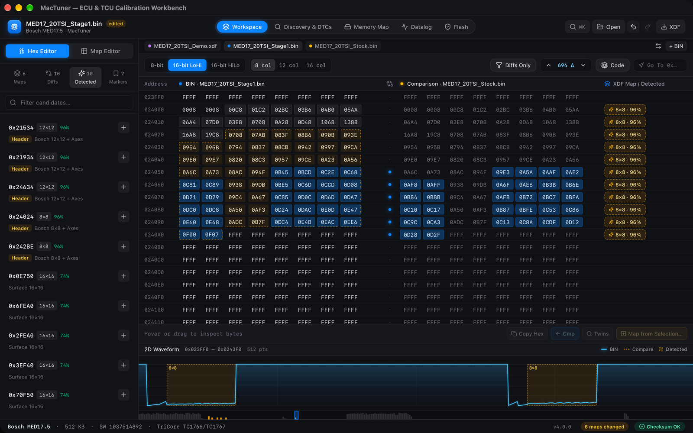
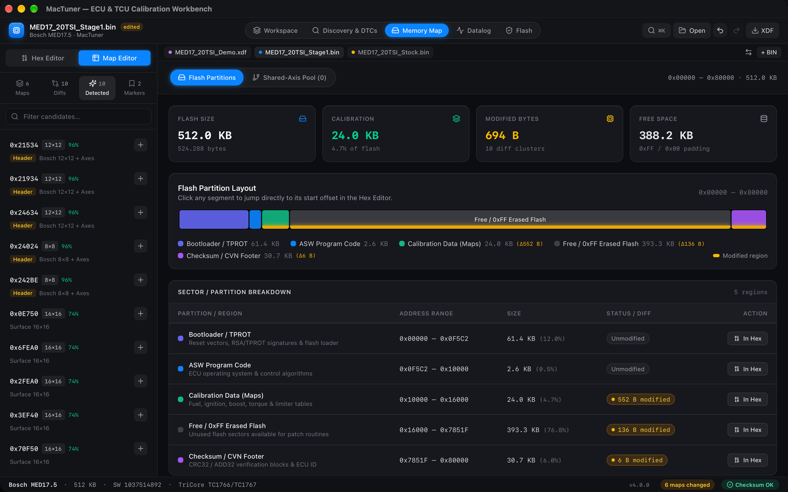

<p align="center">
  
</p>

<h1 align="center">MacTuner</h1>

<p align="center">
  <strong>Built like a Mac app. Runs everywhere — macOS, Windows, Linux &amp; Web.</strong><br>
  Apple Pro Obsidian ECU &amp; TCU calibration workbench: Jewel-Tile Thermal Heatmap, Interactive 3D Surface, 60-FPS Split Hex-Diff, Structural Map Detection, Disassembler XREFs, 11 Checksums &amp; Virtual Dyno.
</p>

<p align="center">
  <a href="../../releases/latest"></a>
  <a href="https://mactuner.azendix.de/web/"></a>
  
  
  
</p>

<p align="center">
  <a href="https://mactuner.azendix.de"><strong>Website</strong></a> ·
  <a href="https://mactuner.azendix.de/web/"><strong>Web App</strong></a> ·
  <a href="#gallery">Gallery</a> ·
  <a href="#features">Features</a> ·
  <a href="#install">Install</a> ·
  <a href="#supported-formats">Formats</a> ·
  <a href="#building">Building</a>
</p>


**MacTuner 4.0** is an open-source ECU &amp; TCU tuning workbench built with **TypeScript, React, Canvas, and Tauri v2**. Every edit is non-destructive, undoable, and strictly byte-exact: when exporting a binary, only the exact bytes of edited values (and corrected checksums) change.

---

## Gallery

| **Split Hex-Diff, Map Detection &amp; 2D Waveform** | **Visual Memory Map &amp; Shared-Axis Pool** |
|---|---|
|  |  |
| **Flash Preflight, Checksums, Diagnostics &amp; Snapshots** | **20 Hz Datalogger, XY Scatter &amp; Virtual Dyno** |
|  |  |

---

## Features

- **Map Editor &amp; 3D Calibration:** Jewel-Tile thermal heatmap, top-down Lambertian 3D surface with comparison wireframe, smooth Catmull-Rom 2D curves, 3-way crosshair sync, multi-cell editing (`+%`, Smooth, Interpolate, Fill, `f(x)` formulas), and curve-preserving Axis Rescaling.
- **Split Hex-Diff &amp; Reverse Engineering:** 60-FPS virtualized Split Hex-Diff, Live Mini-Heatmap HUD, 2D Waveform, structural map detection (*Header Proof*), and TriCore / PowerPC / C166 Disassembler + Code XREFs.
- **Checksums, DTCs &amp; Preflight:** 11 built-in ECU/TCU checksum plugins (Bosch ME7, MED17/EDC17, MG1/MD1, BMW MEVD17.2, Siemens SIMOS, Simos 18/19, Continental SID208/305/310, Temic DQ250, DQ381/DQ500, DL501, CRC-32), OEM DTC table switcher, Pre-Save Diff Review (`⌃⌘S`), Snapshots, and flash-tool export presets.
- **Datalogging &amp; Virtual Dyno:** 20 Hz datalogger, CSV / `.adx` / `.ads` import, XY scatter, 4-cell bilinear heatmap tracing, Math Channels, and SAE J1349 Virtual Dyno (HP / Nm).
- **Definitions &amp; Reports:** Built-in XDF editor, Shared-Axis Pool, Diagnostics &amp; Lint, Command Palette (`⌘K`), and standalone offline interactive HTML tune reports.
- **Multiplatform &amp; Local-First:** Native desktop app via Tauri v2 (signed auto-updater, 25 languages) plus a 100% client-side [Web App](https://mactuner.azendix.de/web/) — zero uploads, zero telemetry.

---

## Install

- **Web (no install):** Open **[mactuner.azendix.de/web](https://mactuner.azendix.de/web/)** — runs 100% locally in your browser.
- **macOS (Universal Apple Silicon &amp; Intel):** Download `MacTuner-4.0.0.zip` from [**Releases**](../../releases/latest) and move `MacTuner.app` to `/Applications`, or install via Homebrew (`Casks/mactuner.rb`):
  ```sh
  brew upgrade --cask mactuner
  ```
  If macOS Gatekeeper blocks the first launch:
  ```sh
  xattr -dr com.apple.quarantine /Applications/MacTuner.app
  ```

> [!WARNING]
> **Always verify checksums with your flashing tool before flashing.** Wrong calibration values or checksums can damage the engine or transmission. Use at your own risk.

---

## Supported Formats

| Category | Formats |
|---|---|
| **Definitions** | TunerPro XDF 1.60 XML (incl. `<TABLEINFO>`), legacy XDF v1.11, ASAP2 `.a2l` / DAMOS, WinOLS v2–v5 `.ols` / `.kp` / `.csv`, RomRaider `.xml` |
| **Binaries** | Raw `.bin` / `.ori` / `.mod`, Intel HEX (`.hex` / `.ihex`), Motorola S-Record (`.s19` / `.s28` / `.s37` / `.srec`) |
| **Data Types** | 8 / 16 / 32-bit signed &amp; unsigned, Little &amp; Big Endian, column-major, 32-bit IEEE-754 Float, embedded &amp; label axes, `f(x)` equations |
| **Datalogs** | CSV (VCDS, ME7Logger, MHD, BM3, Cobb), TunerPro `.adx` / `.ads` |
| **Reports &amp; Projects** | Standalone interactive HTML tune reports, PDF reports, snapshots |

---

## Building

```sh
cd web
npm ci
npm run build        # Static Web SPA → web/apps/studio/dist/
```

---

## License

[MIT](LICENSE). Not affiliated with TunerPro or WinOLS. No XDF or binary files are included.
